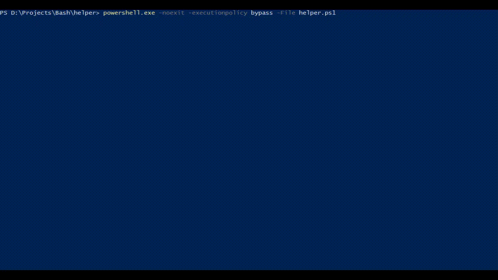

# Java multi module project Helper

## Description

java-helper is a bash script/configuration which makes navigating between, building and running java multi module projects easier. Currently supports gradle projects but can be modified to support others. Maven support will be added soon.

helper.ps1 is a powershell script which supports selecting gradle multi-projects, navigating between the sub-projects under the base multi-project. More features will be added soon.

Some other helpful shell scripts and a multi-module project to test the java-helper file can be found [here](https://github.com/SagaBegins/demo-mm-java).

## Using java-helper.rc

    source <path to helper> [options]

Options supported by java-helper

- `-n|--no-info`: Does not print helper info.
- `-v|--vpn`: Connects to openvpn server.
- `-c|--chdir`: Changes directory to Base of project.
- `-p|--custom-ps1`: Uses custom ps1

Most of the commands available have `-h|--help` option to describe how the command can be used.

Some commands which java-helper supports

- `helper_info`: Prints some helpful information.
- `chdir <project-name>`: Change directory between subprojects.
- `bld [project-name] [options]`: Clean builds a specific project.
- `btrun [project-name] [options]`: Runs spring boot project.
- `show_jacoco [project-name]`: Opens the java code coverage html of the specified project or current directory if nothing is provided.
- `show_checkstyle [project-name]`: Opens the checkstyle html of the specified project or current directory if nothing is provided.
- `edit_config`: Opens config in gedit.
- `edit_helper`: Opens helper in gedit.
- `open_file <code-file-name>`: Opens the specified code file in visual studio code.

## Using helper.ps1

    powershell -noexit -executionpolicy bypass -File <path to helper.ps1>

Commands

- `Select-Project <path>`: Scans for gradle sub projects in the specified path.
- `Get-Project-Name <path>`: Returns project name extracted from the path.
- `Set-Project-Location [project-name]`: Changes directory to the specified project. If no argument is passed changes directory to base directory of the multi-project.
- `Open-File <file-name>`: Opens the specified java code file name.
- `Scan-Code`: Scans the present directory for .java files.
